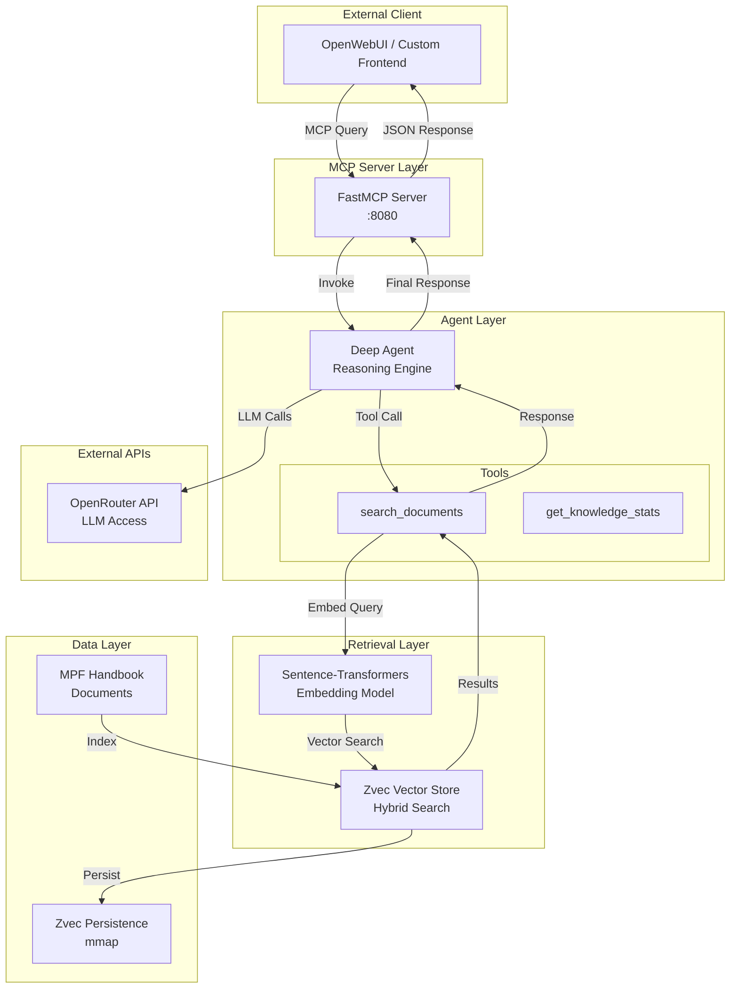
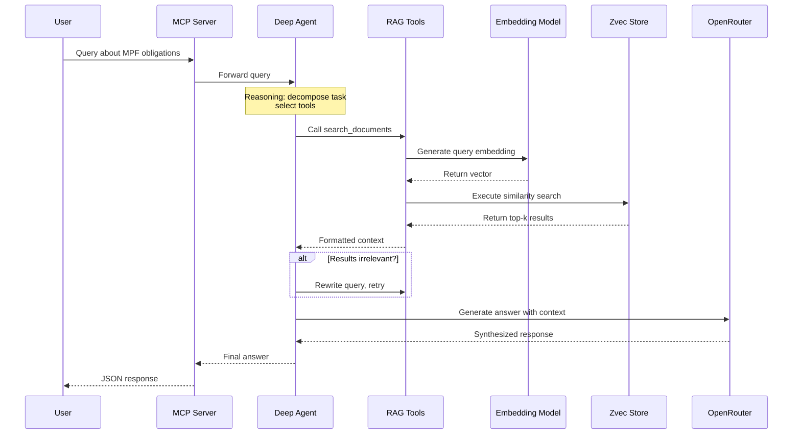

# MPF Employer RAG - Architecture

## System Overview

The MPF Employer RAG is an agentic retrieval-augmented generation system designed to answer questions about Mandatory Provident Fund (MPF) employer obligations in Hong Kong. The system combines a reasoning agent with local vector storage and external API connectivity to provide accurate, context-aware responses.

The system uses a layered architecture with three main components: an **Agent Layer** for reasoning and tool orchestration, a **Retrieval Layer** for semantic search via Zvec, and a **Data Layer** for document storage and management.

---

## High-Level Diagram



---

## Component Breakdown

### 1. Agent Layer

The Agent Layer is powered by **Deep Agents**, an opinionated framework built on LangChain/LangGraph. This layer handles reasoning, task decomposition, and tool orchestration.

**Key Components:**

- **Deep Agent Engine**: The core orchestrator that manages the reasoning loop, tool selection, and response synthesis. It uses a checkpointed state to maintain conversation context across multiple turns.

- **System Prompt**: Defines the agent's behavior and guidelines, including:
  - Task decomposition for multi-step queries
  - Self-correction and reflection protocols
  - Source citation requirements
  - Ambiguity handling procedures

- **RAG Tools**: Custom tools that bridge the agent to the retrieval layer:
  - `search_documents`: Executes semantic search against the knowledge base
  - `get_knowledge_stats`: Returns metadata about indexed documents

- **Memory Management**: Uses LangGraph's MemorySaver for conversation state persistence, allowing the agent to maintain context across sessions.

**Reasoning Loop Flow:**

1. Receive user query
2. Decompose into sub-questions if complex
3. Execute tool calls as needed
4. Evaluate retrieved context for relevance
5. Rewrite search query and retry if results are poor
6. Synthesize final response with citations

### 2. Retrieval Layer

The Retrieval Layer handles embedding generation, vector search, and result ranking. It uses **Zvec**, an in-process vector database from Alibaba, for high-performance similarity search.

**Key Components:**

- **Embedding Model**: Sentence-Transformers (`all-MiniLM-L6-v2`) generates 384-dimensional dense vectors from text queries and documents.

- **Zvec Collection**: The vector store is configured with:
  - `embedding` field: Dense FP32 vectors (384 dimensions)
  - `text` field: String field for document content
  - HNSW index for fast approximate nearest neighbor search

- **Hybrid Search Support**: Zvec supports both dense and sparse vectors. Current implementation uses dense embeddings for semantic similarity, with infrastructure ready for sparse/BM25 integration.

**Search Flow:**

1. Receive query string from agent
2. Generate embedding via Sentence-Transformers
3. Execute vector search in Zvec
4. Retrieve top-k results with relevance scores
5. Return formatted context to agent

### 3. Data Layer

The Data Layer manages document storage, indexing, and persistence.

**Key Components:**

- **Source Documents**: MPF Employer Handbook (Markdown format) containing:
  - Trustee and scheme selection
  - Employee enrolment procedures
  - Contribution calculations and deadlines
  - Termination notification requirements

- **Document Processing Pipeline** (`rag/index.py`):
  - Load Markdown documents
  - Parse HTML converted from Markdown
  - Split into chunks (1000 chars, 200 overlap)
  - Generate embeddings
  - Index to Zvec

- **Persistence**: Zvec uses memory-mapped files for persistence. The collection is stored at `data/zvec` and survives process restarts.

**Indexed Data:**

- 69 document chunks from the MPF Employer Handbook
- Each chunk includes semantic embedding and raw text content

---

## Data Flow

### Request Lifecycle



**Detailed Steps:**

1. **Query Ingestion**: User sends question via MCP protocol to the FastMCP server.

2. **Agent Reasoning**: Deep Agent analyzes the query, determines if multi-step decomposition is needed, and selects appropriate tools.

3. **Embedding Generation**: The `search_documents` tool invokes Sentence-Transformers to convert the query into a 384-dimensional dense vector.

4. **Vector Search**: Zvec executes approximate nearest neighbor search using HNSW indexing, returning the top-k most similar document chunks.

5. **Context Formatting**: Results are formatted with relevance scores and truncated text content.

6. **Self-Correction Loop**: If the agent determines retrieved context is irrelevant or insufficient, it rewrites the query and retries the search.

7. **Response Synthesis**: The agent sends the retrieved context along with the original query to OpenRouter (via OpenAI-compatible API) for final answer generation.

8. **Response Delivery**: The MCP server formats the response and returns it to the client.

---

## Infrastructure and Stack

### Technology Stack

| Component | Technology | Version |
|-----------|------------|---------|
| Language | Python | 3.11+ |
| Package Manager | uv | - |
| Vector Database | Zvec | 0.3.0 |
| Agent Framework | Deep Agents | 0.5.x |
| LLM Framework | LangChain / LangGraph | 1.x |
| Embeddings | Sentence-Transformers | 3.0.0 |
| MCP Server | FastMCP | 3.2.0 |
| API Gateway | OpenRouter | - |

### Project Structure

```
mpf-employer-rag/
├── mcp/
│   └── zvec_server.py          # FastMCP server (query endpoint)
├── agents/
│   ├── rag_agent.py            # Deep Agent definition
│   └── rag_tools.py            # RAG tool implementations
├── rag/
│   ├── index.py                # Document indexing script
│   ├── zvec_db.py              # Zvec wrapper
│   └── doc/                    # Source documents
├── config/
│   └── settings.py             # Configuration management
├── data/
│   └── zvec/                   # Persisted vector store
├── .env                        # Environment variables
├── pyproject.toml              # Dependencies
└── README.md                   # Quick start guide
```

### Environment Configuration

All configuration is managed via `.env` file:

```
OPENROUTER_API_KEY=<key>
OPENROUTER_BASE_URL=https://openrouter.ai/api/v1
OPENROUTER_MODEL=anthropic/claude-3.5-sonnet
MCP_HOST=0.0.0.0
MCP_PORT=8080
SEARCH_TOP_K=5
```

### Running the System

**Prerequisites:**

- Python 3.11+
- uv package manager
- OpenRouter API key

**Quick Start:**

```bash
# Install dependencies
uv sync

# Index documents (one-time setup)
uv run python rag/index.py

# Start MCP server
uv run python mcp/zvec_server.py

# Run agent (requires API key)
uv run python agents/rag_agent.py
```

---

## Design Decisions

### Why Deep Agents?

The project uses Deep Agents instead of raw LangChain for several reasons:

- Built-in middleware for todo tracking, filesystem access, and sub-agent delegation
- Structured tool integration with automatic schema generation
- Checkpointing for conversation state persistence

### Why Zvec?

- In-process operation eliminates network latency
- Memory-mapped persistence for durability
- Native support for hybrid dense/sparse search
- High performance with HNSW indexing

### Why MCP?

- Standardized protocol for external frontend integration
- Enables OpenWebUI connectivity
- Clear separation between agent logic and interface layer

---

## Future Considerations

- **Hybrid Search**: Integrate sparse vectors (BM25) alongside dense embeddings for improved recall
- **Multi-Source RAG**: Add Hong Kong Open Data API integration for real-time policy updates
- **Persistence Upgrade**: Consider LangGraph Store for long-term memory across sessions
- **Evaluation**: Implement RAGAS metrics to measure answer quality
