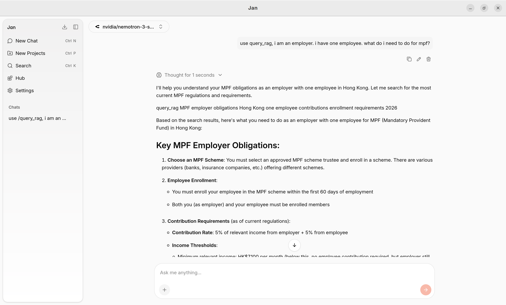
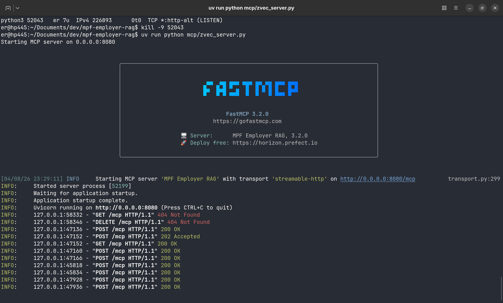

# MPF Employer RAG - Agentic RAG with LangChain Deep Agents + Zvec + MCP





## Architecture

The MPF Employer RAG is an agentic retrieval-augmented generation system designed to answer questions about Mandatory Provident Fund (MPF) employer obligations in Hong Kong. The system combines a reasoning agent with local vector storage and external API connectivity to provide accurate, context-aware responses.

The system uses a layered architecture with three main components: an **Agent Layer** for reasoning and tool orchestration, a **Retrieval Layer** for semantic search via Zvec, and a **Data Layer** for document storage and management.

```
External Frontend (OpenWebUI / Jan.ai)
         │
         ▼ (MCP - query tool only)
    MCP Server (FastMCP)
         │
         ▼
    Deep Agents (with planning, reflection)
         │
         ▼ (tool call)
    Zvec (hybrid search)
```

## Quick Start

### 1. Index Documents
```bash
uv run python rag/index.py
```

### 2. Run MCP Server
```bash
uv run python mcp/zvec_server.py
```
MCP server runs on http://localhost:8080

### 3. Run Agent (requires OPENROUTER_API_KEY)
```bash
export OPENROUTER_API_KEY=your_key
uv run python agents/rag_agent.py
```

## Environment Variables

Copy `.env.example` to `.env` and fill in:
```
OPENROUTER_API_KEY=your_api_key
OPENROUTER_BASE_URL=https://openrouter.ai/api/v1
OPENROUTER_MODEL=google/gemma-4-31b-it:free
MCP_HOST=0.0.0.0
MCP_PORT=8080
SEARCH_TOP_K=5
```

## Configuration

See `config/settings.py` for:
- Zvec path, embedding model
- MCP server host/port
- Search top-k, chunk size

## MCP Server Connection

### OpenWebUI

1. Ensure the MCP server is running:
   ```bash
   uv run python mcp/zvec_server.py
   ```

2. In OpenWebUI, go to **Settings** → **Admin Panel** → **Connections**

3. Under **MCP Servers**, add a new server:
   - **Name**: MPF Employer RAG
   - **URL**: `http://localhost:8080/mcp`
   - Or use STDIO mode with command: `uv --directory /path/to/mpf-employer-rag run mcp/zvec_server.py`

4. The following tools will be available:
   - `query_rag`: Query MPF knowledge base
   - `get_stats`: Knowledge base statistics

### Jan.ai

1. Ensure the MCP server is running:
   ```bash
   uv run python mcp/zvec_server.py
   ```

2. Open Jan.ai and go to **Settings** → **MCP Servers**

3. Click **+ Add MCP Server** and configure:
   - **Name**: MPF Employer RAG
   - **Transport**: `HTTP` (Streamable HTTP)
   - **URL**: `http://localhost:8080/mcp`
   - **Env** (optional): Add any environment variables if needed

4. Toggle the server on. A green indicator shows when active.

5. Available tools:
   - `query_rag`: Query MPF knowledge base
   - `get_stats`: Knowledge base statistics

## Tools

### MCP Tools
- `query_rag`: Query MPF knowledge base
- `get_stats`: Knowledge base statistics

### Agent Tools
- `search_documents`: Search knowledge base
- `get_knowledge_stats`: Get stats

## Project Structure

```
mpf-employer-rag/
├── mcp/zvec_server.py    # FastMCP server
├── agents/
│   ├── rag_agent.py      # Deep Agents
│   └── rag_tools.py      # RAG tools
├── rag/
│   ├── index.py          # Document indexing
│   ├── zvec_db.py        # Zvec wrapper
│   └── doc/              # Source documents
├── config/settings.py    # Configuration
└── pyproject.toml
```
